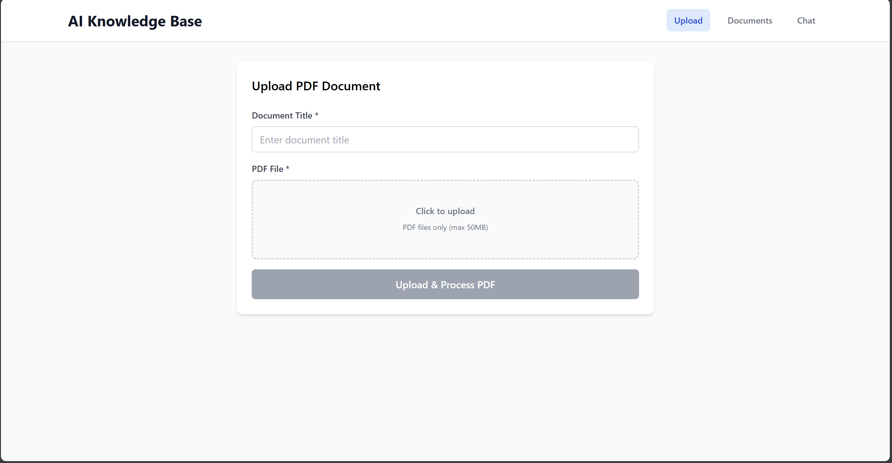
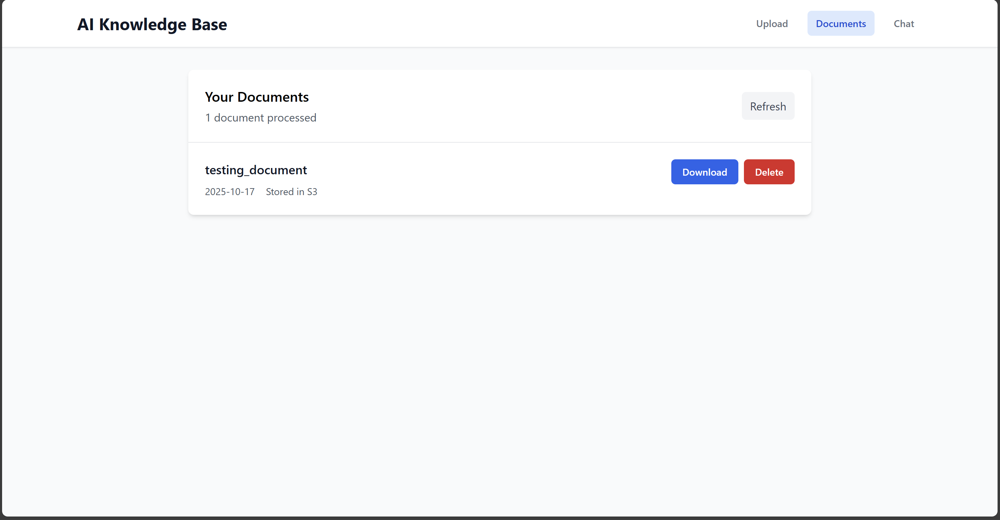
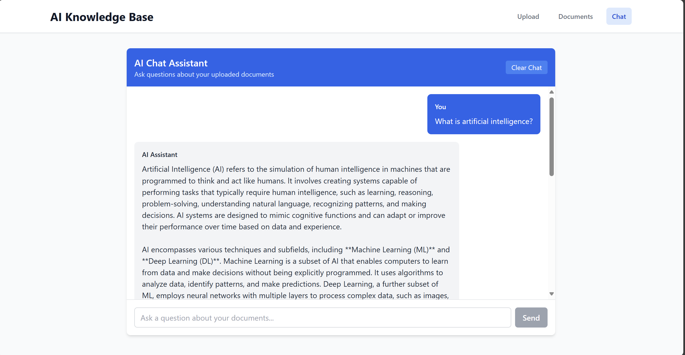
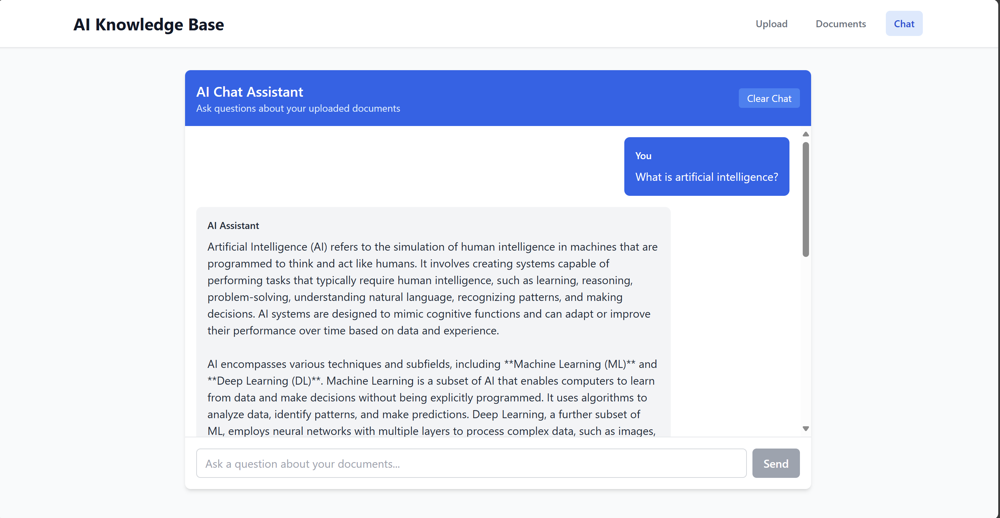

# AI Knowledge Base - Full Stack Application

## Project Overview

The AI Knowledge Base is a full-stack web application that allows users to upload PDF documents, process them with AI, and interact with the content through an intelligent chat interface. The system uses vector embeddings and semantic search to provide accurate, context-aware responses based on the uploaded documents.

## Application Screenshots

### Document Upload Interface

*Secure PDF upload with title validation and file processing*

### Document Management

*Document listing with download and delete functionality*

### AI Chat Interface

*AI-powered chat with clean, modern interface*

### Chat with Sources

*AI responses with source attribution and document references*

## Features

- **Document Management**: Upload, view, and delete PDF documents
- **AI-Powered Chat**: Natural language queries with semantic search
- **Vector Embeddings**: Automatic text processing and embedding generation
- **Secure File Storage**: AWS S3 integration with signed URLs
- **Real-time Processing**: Instant document processing and query responses

## Documentation

- [Technical Details](TECHNICAL_DETAILS.md)
- [Deployment Guide](DEPLOYMENT.md) 
- [Security Implementation](SECURITY.md)

## Technology Stack

**Frontend:** React, Tailwind CSS, Vite
**Backend:** Node.js, Express, PDF.js
**AI Services:** Cohere AI for embeddings and chat
**Database:** Supabase with PostgreSQL and pgvector
**Storage:** AWS S3 for document storage
**Deployment:** Railway (Backend), Netlify (Frontend)
